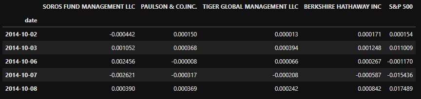
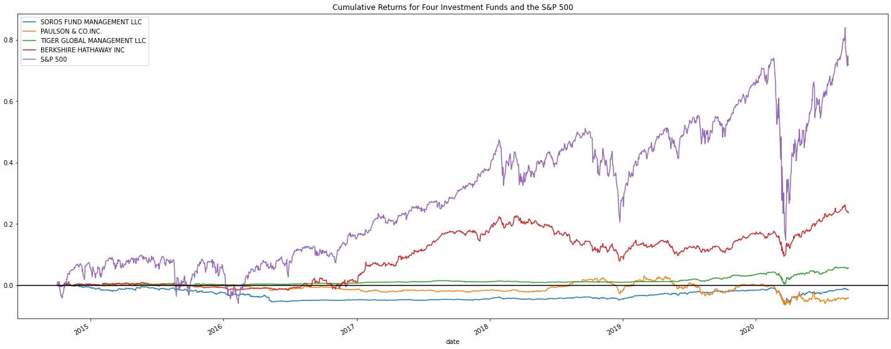
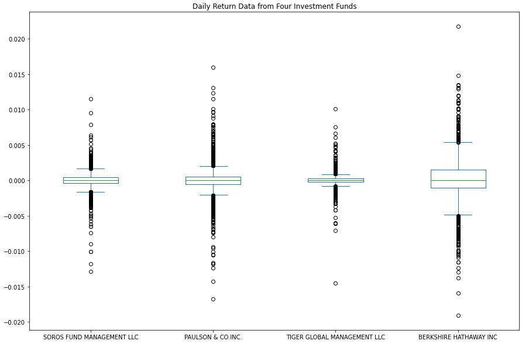
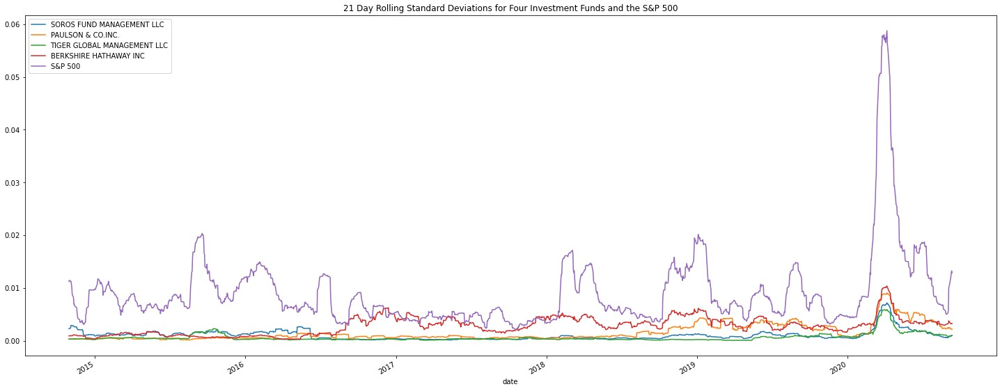
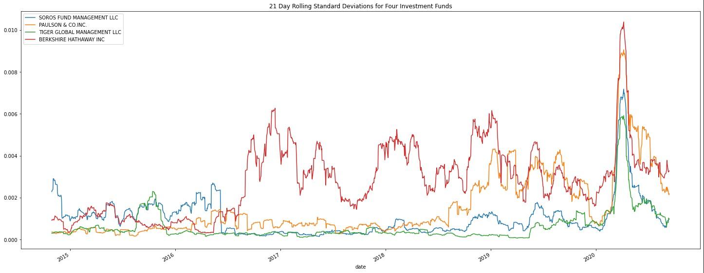
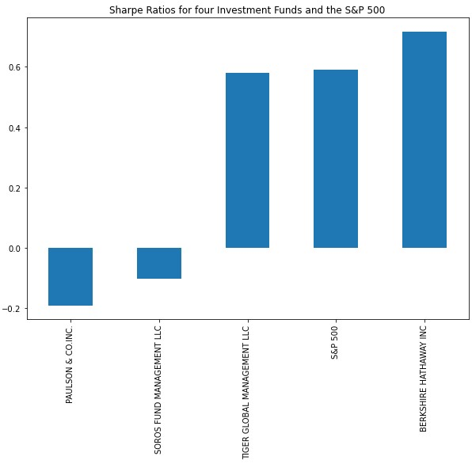
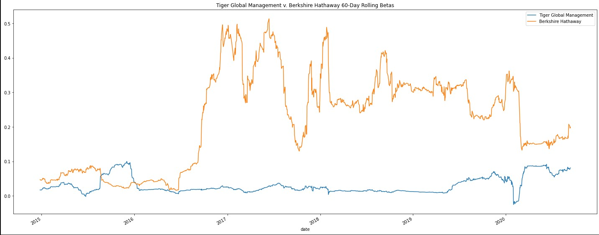

# Ivestment Fund Analysis

## Overview and Purpose
This project analyzes the risk and return of four different investment funds in order to make a recommendation for which fund would make the best addition to an investment portfolio. To make this determination, it will take into account several different risk-management metrics: daily return, standard deviation, beta, and the Sharpe ratio. It is the weekly challenge for Module 4 of the UW fintech Bootcamp, Quantitative Analysis with Pandas.

The purpose of this project is to demonstrate proficiency using Python Pandas to calculate and interpret key metrics used in quantitative financial analysis.

## Process

### Initial Steps
After importing the data from a CSV file containing Net Asset Value (NAV) data from the four investment funds, the first step is to calculate the daily return values for the DataFrame. To do this, I used the code `daily_returns = whale_navs_df.pct_change().dropna()` which assigns the daily returns to a new DataFrame and drops all null values.

### Quantitative Analysis
One important aspect of quanititative analysis for this project is a line plot visualization of the cumulative returns for each fund against the S&P 500. This tells us how much return an investor might expect from each fund in comparison to the market index.

To calculate the cumulative returns, I used the code `cumulative_returns = (1 + daily_returns).cumprod() - 1` and then plotted the returns:

From this visualization we can observe that, outside of a few brief time periods in 2015 and 2016, none of the funds outperform the S&P 500, although Berkshire Hathaway does come relatively close at times.

### Analyzing the Volatility and Risk

The next factor to consider is the volatility and risk profile of each fund. We can get a rough idea of the volatility by plotting the daily returns for each fund on a box plot:

We can investigate the volatility and risk further by calculating and plotting the standard deviations of the different funds in comparison to the market. I used a 21-day rolling window to plot the standard deviations.

We can get a clearer picture of the standard deviations of the funds in comparison to each other by eliminating the S&P 500 data from the plot:

### Analyzing the Risk-Return Profile
To decide which investment would be the best, we must analyze the risk and return together. To do this, I used the Sharpe Ratio and beta metrics.

To calculate and sort the Sharpe ratios, I used the code `sharpe_ratios = (annualized_average_returns / annualized_standard_deviations).sort_values()`, which I then plotted on the following bar chart:

Based on the Sharpe ratios, I decided to only focus on Berkshire Hathaway and Tiger Global Management LLC going forward.

To calculate the beta for each fund, we first much calculate the market variance and the covariance for each fund. For each of these calculations, I used a 60-day rolling window. To calculate the market variance, I used the code `market_rolling_60_variance = daily_returns['S&P 500'].rolling(window=60).var()`

To calculate the covariance for the funds, I used the code `berkshire_hathaway_rolling_60_covariance = daily_returns['BERKSHIRE HATHAWAY INC'].rolling(window=60).cov(daily_returns['S&P 500'])` as well as the corresponding code for the other fund, Tiger Global Management.

For the final step of the analysis, I used the code `berkshire_hathaway_rolling_60_beta = berkshire_hathaway_rolling_60_covariance / market_rolling_60_variance` to calculate the betas, and plotted the rolling betas on a line plot to compare:

## Conclusion

Based on the 60-day rolling beta, Berkshire Hathaway appears to be more sensitive to movements in the S&P 500, however it is not extremely sensitive, since the beta rarely measures greater than 0.5.

Taking all of the data into account, I recommend Berkshire Hathaway as the best addition to an investment portfolio because, based on its Sharpe ratio, it appears to have the best risk-adjusted return. Although it is more sensitive to market fluctuation than Tiger Global Management, and therefore more volatile, it provides a greater cumulative return, and is significantly less risky than the S&P 500 based on its standard deviation. By investing in this fund, the investor will yield a significant amount of cumulative return while also managing risk by investing in a fund that is less volatile than the market as a whole.

---

## Technologies
* Jupyter Lab and Jupyter Notebooks
* Python 3.9
* Python Pandas, Numpy, and the Path module from Pathlib

---

## Contributors
Lydia Ciummo - lydiaciummo@hotmail.com

---

## License
GNU General Public License v3.0